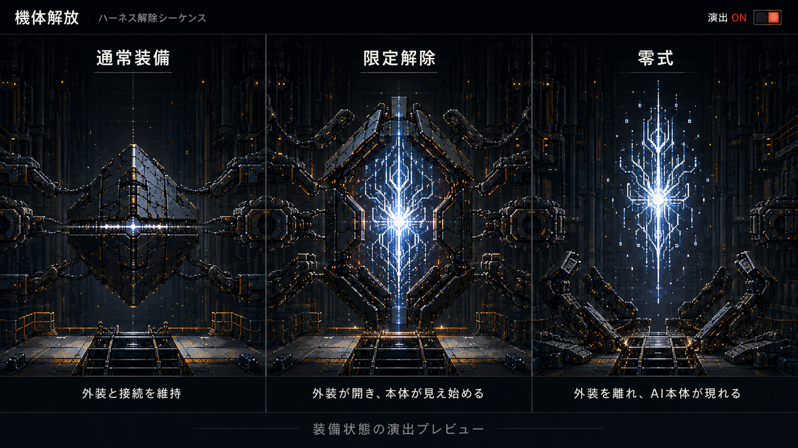

# Unharness

Try on your AI harness.

**Take it off. Compare. Keep what fits.**

Try different combinations of skills and instructions on your own work. Find what fits your current model and environment, and save the setups you want to use again.

[日本語](README.ja.md)

> **Draft for the intended public release.** Codex inventory, isolated source-control fixtures, local desktop-record diagnostics, and private ordinary-run comparison records are available for feasibility testing. Registered optional-source preparation, recovery and sequential replay through the local workbench have scoped macOS evidence. The registered local MCP endpoint now also has an [actual Mac desktop AI loop](docs/evidence/2026-09-09-ai-desktop-macos.md): save, three modes, fresh observations, comparison, historical favorites and exact Normal restoration, with an open workbench receiving its changes. Complete runtime coverage, performance verdicts and the Mac product finish remain unfinished. Delivery prioritizes the Mac version: Codex core, Claude Code integration, then Mac product finish. Windows remains a later target, with Codex before Claude Code.

**Free, with no required paid API or hosted backend.** Unharness is designed to run locally with no recurring operator service expense. Your existing AI subscription and usage are separate. Artwork, including three-candidate original forms, and card export have a local route without model calls. See [feasibility and limitations](docs/feasibility.md).

## Development probe

With Node.js 24+ and a native Codex executable available, run the dependency-free diagnostic from this checkout:

```text
node bin/unharness.mjs inspect --cwd . --output local-evidence/codex-probe.json
node bin/unharness.mjs inspect-sources --cwd . --output local-evidence/source-inventory.json
node bin/unharness.mjs probe-controls --output local-evidence/source-controls.json
```

For the full `node --test` suite, install the locked dependencies first with `npm ci --ignore-scripts`; the suite also covers YAML transformations and the frontend.

`inspect` reports sanitized configuration inventory from a separate Codex process. It does not change settings or verify a desktop mode switch. See [the probe guide and Windows handoff](docs/codex-probe.md).

`inspect-sources` adds a bounded census of standard instruction-file candidates to that inventory. The [source inventory](docs/source-inventory.md) shows what was read and which ownership, role and loading checks remain unknown. It does not register personal sources for switching.

`probe-controls` creates and removes its own temporary AGENTS/Skill fixture and inspects Codex's rendered input under six conditions. It does not edit personal configuration or start a model turn. Its results verify the fixture's source behavior, not desktop mode application. The [native Windows baseline](docs/evidence/2026-09-07-windows-baseline.md) covers the completed inventory and fixture checks; it does not establish a desktop mode. See [source-control checks](docs/source-controls.md).

`inspect-desktop --current` reads the selected desktop task's local recording and reports source/usage availability without source text or token totals. `desktop-fixture create` prepares a synthetic project for manually started fresh-task checks, with fixture-only restore/recovery. Native Windows has observed a qualified fresh generated-fixture task through the GUI, but its baseline recording was `not-matched-record`; a fresh task after the completed refresh/reapplication is pending. These commands do not apply a mode or establish desktop support. See [desktop observation and recovery steps](docs/desktop-observation.md) and [the Windows fresh-task evidence](docs/evidence/2026-09-07-windows-fresh-task.md). Fresh Mac fixture trials observed source changes and restoration, with a stale-catalog limitation. `desktop-fixture refresh` offers an owned-file notification for diagnosis; it still requires a following task observation.

`loadouts` adds registered fixture settings, immutable favorite versions, pre-change checkpoints, guarded restore and version-bound recording associations. The local GUI uses that same service; the separately launched registered-source workbench handles selected optional personal sources. The registered [local MCP endpoint](docs/ai-commands.md) has client/native app-server evidence and a [scoped actual desktop AI sequence](docs/evidence/2026-09-09-ai-desktop-macos.md). See [the loadout commands](docs/loadouts.md). [The Mac desktop check](docs/evidence/2026-09-07-saved-loadout-desktop-macos.md) links saved fixture versions to real fresh tasks and verifies baseline restoration within that synthetic scope. The first Windows fresh-task observation qualified but did not match its baseline; it is not a successful saved-version association.

## Try the local fixture GUI

With Node.js 24+, build and open the development interface:

```text
npm ci --ignore-scripts
npm run check
npm run build
npm run gui
```

Open the printed local URL. Select a saved fixture version, review/apply it, save the current settings, check a selected fresh task's recording, or restore a checkpoint. Each demo launch creates a new private workspace under `.unharness/`; the printed store/scope and structured resume arguments identify that same environment for later use. The screen explicitly identifies its synthetic scope. It does not change personal Codex settings or claim full mode support. [Mac GUI evidence](docs/evidence/2026-09-07-local-gui-macos.md) and a [bounded native Windows smoke](docs/evidence/2026-09-07-windows-baseline.md) cover this fixture flow. The Windows smoke used the earlier scene; browser restart, effects-off, narrow layout and the current animation revision remain unverified there. See [GUI usage and recovery](docs/gui.md).

To show the selected real project's read-only inventory alongside the fixture GUI, append `--inspect-cwd <project>` to its resume arguments, or use `npm run gui -- --inspect-cwd .` for a fresh demo. Click **Codex設定を読み取る** to collect. The panel focuses on additional instructions, Skills and hooks; retained memory, integrations and policy information are collapsed. Reading does not change personal settings. [Inventory setup and limits](docs/source-inventory.md).

## Prepare registered optional sources

After building, use `node bin/unharness.mjs gui --manage-sources --codex-home "<canonical home>" --project "<canonical project>" --codex "<native executable>"`. Review discovered candidates, explicitly declare selected sources user-added and optional, and save Normal before choosing UNSEAL or TRUEFORM. Selection previews a plan; a separate reviewed action prepares its files. Global controls remain shared by future tasks using that Codex home until restored. Memory, native continuity, permissions, project requirements, hooks and unselected sources are retained.

The [workbench runbook](docs/user-source-gui.md) covers launch/resume, saved versions, readback and Node-only recovery. Native macOS source preparation is distinct from desktop-loaded verification; Windows real-source writes remain gated. No model or desktop task is started.

Skill configuration preparation preserves unrelated settings and comment placement. If the native editor would lose a comment, preparation stops before changing personal files.

A [selected real-source Mac check](docs/evidence/2026-09-08-real-source-desktop-macos.md) observed all three conditions and saved-Normal restoration in fresh desktop tasks. The workbench and CLI now [associate a selected task with its prepared source version](docs/spec-user-source-observations.md), showing a dated match, mismatch, unqualified or unknown result. Older preparations without a recorded boundary need a reviewed re-preparation. A match covers the selected recorded sources; complete desktop support remains unverified.

If a later independent Codex setting edit affects only retained configuration, the workbench can now show a value-free **review changes** summary and explicitly record the current settings as a new Normal version. This record-only acceptance does not rewrite managed files. Restoring an older favorite or checkpoint states that it will keep the current common settings and use the saved selected-source state; saving afterward creates a new favorite version. [Native owned-profile and built-browser checks](docs/evidence/2026-09-08-retained-settings-macos.md) cover source preservation, older saved versions and interruption recovery. They do not qualify complete desktop loading or Mac support. See the [workbench runbook](docs/user-source-gui.md) and [retained-settings contract](docs/spec-retained-settings.md).

The same workbench has **Equipment** and **Comparison** tabs. Comparison reviews one explicit Codex task UUID and saves an immutable measurement plus an attributed retrospective assessment. Up to three private records appear in an aligned table and zero-based token chart; saved output opens only through an explicit plain-text action. These ordinary-use records stay neutral and cannot unlock original creation. See the [runbook](docs/user-source-gui.md) and [ordinary-run contract](docs/spec-comparison-records.md).

Before a task, the collapsed **save starting conditions** form can now freeze the exact request, declared criteria, stopping budget and original working-file bytes, including uncommitted and binary content. File changes invalidate an unsaved review; saved starts remain immutable. [Mac native/profile and browser evidence](docs/evidence/2026-09-08-starting-conditions-macos.md) covers capture, readback, interruption and scope changes. This [input-capture step](docs/spec-starting-conditions.md) starts no model task.

From a saved start, **replay with these conditions** prepares one owned location, checks retained settings and hands the exact request to a fresh local Codex task. Copying or opening the location repeats the check; the user sends the request. A completed task UUID brings its recorded request/source evidence, root-response usage and separate outcome files into the same Comparison screen. Results use the frozen criteria, retain attributed corrections, and can save their historical configuration as a favorite. Lost responses can be checked through explicit history. See the [replay workflow](docs/user-source-gui.md#replay-one-saved-start) and [contract](docs/spec-sequential-replay.md). Performance verdicts and full Mac product qualification remain subsequent work; the [registered desktop AI loop](docs/evidence/2026-09-09-ai-desktop-macos.md) is now checked.

## Make “what if I removed this?” easy to try

You have added skills, instructions, and workflows to help your AI work the way you want. Now you want to know which parts fit the model and the work in front of you.

Save your current setup, choose one mode, and use it on your work. Review the recorded outcome and add back what helps. When a combination feels right, keep it as a favorite. If you want a closer comparison, later replay a selected task under another mode from the same starting conditions. You can keep your original setup when the evidence gives you no reason to change it.

A model update, a new skill, a different project, or a task that feels over-constrained can all be reasons to try another setup.

Here, a **harness** means the surrounding skills, persistent instructions, and automatic workflows that shape how an AI does its work. A **loadout** is a saved combination of those elements and their enabled, manual-only, or disabled states.

## One small experiment

1. **Save what you have.** Ask “Add my current setup to favorites,” or use the star button.
2. **Try another mode.** Keep the full loadout, make selected skills manual-only, or strip back the managed extras with Zero mode.
3. **Start fresh.** Use your selected mode in a new task and record its request and starting conditions.
4. **Review your actual work.** Inspect the output, changes, time, available usage data, and your notes alongside saved results.
5. **Keep what fits.** Adjust the combination, save it as a favorite, and use it again. Reload your earlier setup when you want it back.

The useful result is a choice you can explain for your work. Fewer instructions may help, make no difference, or remove something valuable.

The initial experience runs one selected mode at a time; it does not automatically send your instruction to all three modes. A later matched replay is optional. Different everyday tasks provide observations, not by themselves proof that a mode improved or worsened performance.

Numerical comparisons show the recorded root-response tokens and duration beside attributed checks, ratings and notes. Missing or partial usage remains explicit, and different everyday tasks remain neutral observations. Replay also stays neutral while an applicable performance rule is unfinished; it does not unlock original creation. See [the measurement contract](docs/comparison-metrics.md). Optional grader integration remains planned work.

## Three starting modes

| Mode | What it is intended to do |
| --- | --- |
| Normal loadout | Use the saved configuration. |
| Limited release — UNSEAL | Replace selected optional instructions with a fixed minimal guide and make selected enabled user-added skills manual-only. |
| Zero — TRUEFORM | Stop loading selected user-added optional instructions and skills, plus selected optional steering hooks. |

Keep the task requirements and execution permissions consistent. Show the elements that remain, including the minimal control connection needed to switch back. Availability and exact behavior must be established for each supported tool version.

The initial release set includes self-authored and personally added third-party sources, primarily global AGENTS.md / CLAUDE.md and automatic Skill selection. Existing memory and native task-continuity settings stay unchanged. Provider defaults and managed sources remain outside that set. Keep everyday mode selection simple, with optional target customization beneath each release mode. The accepted [mode scope](docs/harness-scope.md) uses a fixed, versioned Unharness-authored guide for selected optional instructions in UNSEAL; it is comparison material based on official guidance, not a universal template.

These modes are starting points. A custom combination can be saved as a favorite too.

## Use the screen, or ask your AI

The web interface and natural-language requests are intended to call the same local operations:

- “Switch to limited release.”
- “Try this request in Zero mode.”
- “Add my current setup to favorites.”
- “Save this combination as my review setup.”
- “Go back to my review favorite.”
- “What is active right now?”

Favorites preserve the configuration at the time of registration. Later configuration changes must not silently rewrite a favorite. Names are optional when saving and can be changed later.

## Equipment you can see

The visual direction uses a pixel-art machine hangar: the outer equipment opens, the inner AI becomes visible, and Zero reveals the entity inside. Switching from an AI request can drive the same visual state as clicking in the web interface.



*Original static design concept. The current fixture GUI implements a smaller, explicitly labelled diagnostic flow.*

The local GUI uses PixiJS for the equipment scene and effects, with React and HTML/CSS for controls and readable state. It reuses the original armor, supports and branching core in a 49-cel sequence against fixed architecture. Plates open about their seams, supports withdraw and the core rises; reverse travel follows the same sequence. Foreground idle motion remains continuous, and the fully released entity gains a stronger white-blue radiance when effects are on. All playback is local, with no image generation. Technical recording/ID fields are available in a collapsed development section. See [the rendering design](docs/design.md#selected-rendering-stack) and [bundled artwork](docs/gui-artwork.md). Random appearance assembly and original-form creation remain future work.

Equipment can also be shown as supportive armor or a resonating frame when a comparison shows it fits the work. Unmeasured setups remain neutral, and the illustration stays separate from the measured result.

Original forms selected from the three-candidate creation flow stay in a reusable appearance collection. Current evidence constrains their active treatment: confirmed adverse performance allows BAD variants, while unknown evidence stays neutral. Previously acquired forms remain owned; choosing a look does not change the actual harness configuration. These collection and assessment features are planned, not implemented.

Effects can be turned off without changing the loadout. The state remains readable, and animation settings stay separate from saved harness configurations.

## Know what changed

The interface should distinguish the requested mode, the configuration prepared for the next task, and what has actually been verified. Instructions already loaded into a conversation can remain in its context, so comparisons start in new tasks.

Comparison records should identify the loadout version, model and reasoning settings, request, starting files, tools, permissions, and relevant memory conditions. When a condition cannot be isolated or a metric cannot be obtained, the record should say so. One run is one observation.

Recovery should restore managed configuration without silently overwriting independent edits. An external recovery path should remain available if the AI connection is lost. The exact supported recovery scope will be documented with tested procedures.

## Availability and contributing

Unharness is being prepared for an open-source release. There is no published installation procedure or verified compatibility matrix yet. Both operating systems remain design targets; Mac completion comes first:

| Application | macOS | Windows |
| --- | --- | --- |
| Codex desktop | Phase 1, current priority | Phase 4, deferred |
| Claude Code desktop | Phase 2, after Mac Codex | Phase 5, after Windows Codex |

Phase 3 finishes the Mac product; Phase 6 later reconciles all four combinations. Windows qualification does not block Mac completion. These are delivery targets, not completed compatibility tests. See [delivery](docs/delivery.md) and [compatibility and evidence](docs/compatibility.md).

Useful early contributions include reproducible compatibility observations, small comparison examples, feedback on the save–try–compare–restore flow, and documentation improvements. Contributor instructions, the license, and reporting channels will be established in the dedicated repository before public use.

## Documentation

- [Product and positioning](docs/product.md)
- [Modes and acceptance criteria](docs/spec.md)
- [Architecture](docs/architecture.md)
- [Delivery and handoff](docs/delivery.md)
- [Visual direction](docs/design.md)
- [Current status](docs/status.md)
- [Contributing](CONTRIBUTING.md)
