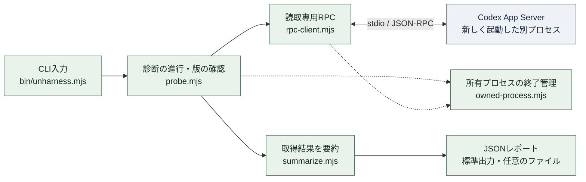
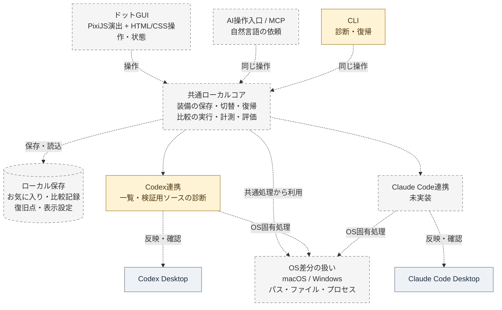

# Architecture boundaries

This page separates the code present on 2026-09-08 from the intended product architecture. The Node.js 24+ runtime includes inventory, source-control fixtures, desktop-record observations, local versioned records, registered optional-source preparation/recovery and private ordinary-run comparison records. The loopback GUI connects the fixture and registered-source services to React/TypeScript and PixiJS; diagnostic/core modules do not import browser dependencies. MCP endpoints, predeclared replay and cross-application migration remain future work.

## Current runnable architecture

The diagram shows the `inspect` processing relationships, not every returned value. The inventory controller invokes the projection and assembles the report; the CLI owns writing it. Dotted edges are shared-helper dependencies in this first diagram. The second diagnostic path is described below the table.

| Responsibility | Current code |
| --- | --- |
| Validate command arguments; print JSON; create a report file without overwriting | [bin/unharness.mjs](../bin/unharness.mjs) |
| Read the CLI version, initialize the child app-server, run the fixed queries, assemble evidence flags | [probe.mjs](../src/codex/probe.mjs) |
| Structured process launch, request allowlist, JSON-RPC framing/IDs, response limits and timeouts | [rpc-client.mjs](../src/codex/rpc-client.mjs) |
| Construct summaries from known fields while omitting instruction text, personal paths and arbitrary values | [summarize.mjs](../src/codex/summarize.mjs) |
| Graceful shutdown, forced termination of the owned child when needed, and awaited closure | [owned-process.mjs](../src/codex/owned-process.mjs) |

The four data queries are `config/read`, `skills/list`, `hooks/list`, and `configRequirements/read`, preceded by initialization. No configuration-write request or model task is started by this command.

The [source inventory](source-inventory.md) adds [inventory.mjs](../src/codex/inventory.mjs), which combines that same probe with a bounded metadata/hash census of standard instruction candidates. Both `inspect-sources` and the opt-in GUI reader call it. Paths and file contents are never evaluated as instructions; no candidate becomes a registered or removable source merely because it was found.

The `probe-controls` path runs through [source-controls.mjs](../src/codex/source-controls.mjs), which owns a temporary fixture and the six-case sequence, and [prompt-input.mjs](../src/codex/prompt-input.mjs), which runs the bounded CLI debug command and projects recognized text into five marker booleans. It reuses the existing version-command and owned-process cleanup behavior. It does not extend the inventory RPC allowlist or retain raw prompt text. Its interpretation and failure boundaries are in [the control-probe contract](spec-source-controls.md).

Both diagnostics are separate from the desktop app's active session. They retain `desktopSessionAttached: false`, `runtimeStateVerified: false`, and `modeSwitchingVerified: false`; inventory coverage is `"unknown"`, and the control probe covers only its owned fixture. Those two diagnostics persist optional JSON reports; they do not use the separate loadout store described below. macOS has real standalone observations; Windows evidence is pending.

## Desktop observation slice

[desktop-record.mjs](../src/codex/desktop-record.mjs) reads a bounded snapshot of one selected local JSONL recording. `--current` discovers filenames for the calling task only and verifies the recorded identity. Projection keeps known source categories, preparation/cwd checks, marker observations, and usage availability; raw content and token totals are discarded. An initial full `world_state` and initial input messages are observations, not an exhaustive model-input contract or a live attachment.

[desktop-fixture.mjs](../src/codex/desktop-fixture.mjs) owns one synthetic project and its control manifest. It prepares baseline, manual-only Skill and fixed-only AGENTS cases without touching personal configuration. Ownership validation, exact source checks, operation locks, pending journals and retained recovery identities support fixture-only restore, interrupted-operation recovery and cleanup. Cleanup retains a small completion receipt. New source publication uses a staged exclusive hard link; filesystem support still needs Windows validation.

[desktop-cli.mjs](../src/codex/desktop-cli.mjs) supplies the local create/set/status/restore/recover/cleanup and observation entry points. It does not start desktop tasks. The operator opens the prepared project as a fresh local task, then the observer relates its recording to the intact preparation snapshot. A source edit during observation prevents association; results remain snapshots rather than perpetual claims about active state.

The [runbook](desktop-observation.md) defines manual startup, evidence interpretation and the deliberately limited recovery scope. Corrupt/partial journals, missing lock ownership, power loss and adversarial filesystem races are not covered as automatic recovery. This fixture mechanism is not yet the shared favorite/configuration transaction engine. Mac has actual fixture loading and refresh observations; Windows still requires fresh-task evidence.

The fixture-only `refresh` operation journals a same-case notification before touching the owned Skill timestamp. It preserves content identity and advances the preparation boundary; it is not a Codex reload API. The observer records known creation routes and rejects known forks as fresh candidates, and recognizes only known text fields in ordinary/custom tool outputs. The [Mac sequence](evidence/2026-09-06-desktop-fixture-macos.md) shows why a new task alone must not be treated as proof of a refreshed Skill catalog.

## Registered loadout core

[local-store.mjs](../src/core/local-store.mjs) owns canonical JSON, content IDs, private fresh stores, exclusive staged publication and corruption checks. It has no Codex dependency. Scope, favorite, checkpoint, application and observation are distinct immutable record types. A favorite's stable configuration omits live preparation; checkpoints and application receipts retain it. User-facing history discovery uses bounded cursor pages so accumulated checkpoints remain accessible. Family identity groups versions without a mutable latest pointer.

[fixture-loadout.mjs](../src/codex/fixture-loadout.mjs) captures the four known generated sources, validates their fixed/optional roles and generation, and passes captured current-state and exact desired-file guards into the existing fixture writer's lock. Other application adapters cannot be inferred from this fixture adapter.

[service.mjs](../src/loadouts/service.mjs) registers scope, saves/lists versions, plans/restores configurations, publishes pre-change checkpoints/application receipts and associates a sanitized recording with an explicit version. An application receipt records a new task-time boundary even when restoring the current case without a source rewrite. The observer checks that boundary as well as fixture preparation and rejects stale application state. Matching fixture markers never promote full runtime/mode verification.

[The CLI](../src/loadouts/cli.mjs) and the local GUI call that service directly. The AI/MCP endpoint remains future work. The [contract](spec-loadout-store.md) and [runbook](loadouts.md) define the current scope, raw-data boundary, explicit versions and recovery sequence. The store does not implement cross-machine migration, an exactly-once protocol or general personal-configuration recovery.

## Local fixture GUI

The [GUI contract](spec-gui.md) limits a server to one registered owned fixture scope. Its controller calls the existing loadout service for plans, save, restore and recording association; the HTTP layer validates the local request boundary and serves only the Vite production output. Browser inputs contain record IDs and a selected task UUID, never arbitrary source paths. The UI receives summaries and explicit local handoff/recovery paths, not source bodies or recordings.

React owns controls, selection and operation feedback. PixiJS owns only the scene and effects. Selection previews a favorite; applying submits its reviewed plan. The core checks exact preparation identity again before writing. A detected external change marks the GUI's application stale, and completed artwork never advances evidence state. The server retains duplicate request identities for the launch, while the core retains immutable favorites, checkpoints, applications and observations on disk. Restarting requires reapplication before a new observation boundary is established.

The Pixi entry includes its local `unsafe-eval` compatibility extension: despite the upstream name, that extension replaces generated helper functions with static implementations. This keeps initialization compatible with the server's strict `script-src 'self'` policy. The dependency check disables runtime code generation to cover this boundary.

An opt-in [inventory reader](../src/gui/inventory.mjs) binds a separate real cwd/native executable at startup, checks target replacement and shares one concurrent collection. Its launch identity is separate from authentication. The browser refreshes metadata before reading and compares it with the identity accepted by the UI; even a failed metadata fetch cannot consume a launch-change check. Inventory runs outside the fixture mutation queue and is never promoted into a favorite/application. This separation keeps fixture recovery usable during an external runtime timeout.

The [initial management scope](harness-scope.md) selects user-added optional instructions, automatic Skills and optional hooks. Memory and native continuity settings are retained comparison conditions. Registration must bind ownership/role decisions to exact source versions; installation scope and presence-only inventory are insufficient.

## Registered user-source preparation

The [user-source contract](spec-user-sources.md) keeps personal-source work in a separate workspace and adapter. A canonical Codex home has one registered Normal, with explicit optional-role declarations and versioned snapshots. Plans derive from that Normal and reference exact before/after state; fixture favorites never become personal-source plans.

The fixed guide and Skill-policy transformer have no model calls. The native configuration editor writes only a private copy in its own temporary CODEX_HOME, changes the selected Skill settings and verifies retained values and comments before returning bytes. Source publication belongs to the transaction layer, which checks the registered scope and current metadata, saves a checkpoint and journal, and reads back each change. Offline recovery uses saved bytes and the same filesystem boundary, without Codex or YAML.

The first writable instruction group is the global Codex AGENTS pair. Project requirements and hooks stay unchanged; provider-owned Skill caches are not edited to manufacture a manual-only control. Successful publication prepares settings for a later task. It does not establish what the current desktop task has loaded or complete the cross-OS support matrix.

The [registered-source observer](spec-user-source-observations.md) binds one selected desktop task to the exact prepared snapshot and preparation identity. It shares the bounded recording reader and uses a private read-only native selector projection to derive frozen Skill intent. Only the canonical initial instruction/catalog fields contribute to source matching; condition hashes and unknown coverage remain separate. A pure record reader serves dated observations without loading Codex or YAML, and invalid optional observation metadata cannot disable configuration status or offline recovery.

The [retained-settings extension](spec-retained-settings.md) versions the saved Normal when an independent configuration edit can be proven to affect retained settings only. Planning uses a private native read plus bounded three-way composition; the browser receives fixed categories, identities and false verification flags rather than configuration keys or values. Acceptance publishes only private state and immutable snapshots, uses a distinct recovery journal and leaves every managed source untouched. The active Normal identity is separate from the immutable registration baseline.

Old favorite and checkpoint records remain immutable. A restore from an older Normal composes its frozen selected-source state with the active Normal's retained settings and returns an explicit adaptation summary. The resulting plan has a new snapshot identity; application does not create or replace a favorite. The HTTP workbench routes these operations through the same accepted launch/context, duplicate-request and uncertain-outcome boundary as existing source actions.

## Ordinary-run comparison records

[run-metrics.mjs](../src/codex/run-metrics.mjs) is the version-specific pure Codex 0.153.4 projector. It consumes records already read by the bounded desktop reader and produces a normalized measurement plus one bounded final answer. Native field names and route/version decisions stay in this adapter. [measurement.mjs](../src/comparisons/measurement.mjs) validates the app-neutral shape and safe nullable counters.

[The comparison service](../src/comparisons/service.mjs) uses the registered workspace lock to collect a review, freeze its historical source context, save immutable assessment versions, page history, compare one to three versions, return output explicitly and save a favorite from a frozen matched association. Reviews live in the application bucket and saved runs in the observation bucket; output text stays in the private review and is absent from ordinary summaries. Reads and private saves do not update source state, managed files or recovery journals.

The registered-source CLI and loopback server expose the same seven operations. Browser requests contain only accepted launch/context identities and bounded task/turn/record selectors; the server supplies the workspace. Strict JSON parsing rejects duplicate decoded keys for comparison bodies. `review-run`, `save-run` and `run-favorite` are treated as private publications: the controller never automatically repeats an uncertain request. A confirmed save remains confirmed when a later history read fails.

React keeps one source controller, API client and operation lock across Equipment and Comparison. Comparison state is scoped to launch, context, workspace and registered scope; a historical review survives mode, revision or active-Normal changes within that scope. A scope/context change clears draft, history, selection and explicit output, and old auxiliary responses cannot install data. React/CSS render the aligned table and proportional bars; the existing Pixi scene/effects and deterministic recovery remain separate.

## Intended product architecture

Every dotted connection below is a planned integration. The CLI and Codex integration boxes have existing diagnostic slices; that does not mean they are already connected to the future shared core or can control the desktop. The OS box represents shared responsibilities, not a library already implemented.

The Unharness-owned control, storage, artwork, and export layers run on the user's computer. Free use with no recurring operator service expense is a product constraint: no paid API, hosted runtime, or free-tier cloud quota is required for the base design. Existing Codex/Claude Code model execution and optional AI authoring/judging use the user's separately chosen AI environment and its allowance. Optional AI judging has a contract but no selected execution implementation. The default three-candidate artwork route is local composition/drawing.

The fixture core uses local content-addressed JSON records. The [selected visual stack](design.md#selected-rendering-stack) uses PixiJS for artwork/effects and React/TypeScript with HTML/CSS for controls and readable state, built with Vite. Production storage migration and the full desktop application/reflection mechanism remain undecided. The database symbol above represents the broader storage responsibility, not a selected database service.

Load PixiJS only through the browser presentation entry point. It consumes saved appearance data and the core's operation/assessment state; a ticker, asset-load completion or animation callback cannot apply settings or mark a task verified. Configuration and recovery remain usable independently of renderer availability. Bundle browser dependencies/assets locally, and keep CLI diagnostics callable without installing the presentation dependencies.

## Shared local core

The web UI and an MCP connection (tools an AI can call) invoke the same operations. The core owns configuration identities, source inventory, versioned favorites, mode policies, change plans, recovery records, experiment conditions, and operation state.

The AI translates a user's request into a registered operation. Filesystem discovery, configuration edits, and restoration are deterministic code. The core must also be callable without the AI so that disabling optional harness elements cannot remove the recovery mechanism.

The core publishes operation events. An open UI reflects them and can animate them; closing the UI or turning effects off cannot change the transaction.

The initial execution flow handles one selected mode at a time and records the user's chosen task. It does not fan out an instruction into several modes. An explicitly requested later replay can use the saved starting conditions; simultaneous trials require separately verified per-session isolation and are outside the initial implementation scope.

The proposed [appearance workflow](personalization.md) uses prepared art packs and weighted local selection by default. A renderer receives the saved recipe and observed mode/operation state. The user's AI can optionally author pixel data or a component recipe, or use an available image tool, then return assets for validated import. The core owns appearance identities, resolved recipes, art-pack versions, and assets; work-memory profiles and experiment evidence are separate. Default appearance selection does not read personal memory, and optional creation does not run inside candidate benchmark tasks. These paths are not present in the current diagnostic.

Original creation becomes available only when the [comparison eligibility rule](personalization.md#original-creation-unlocked-by-comparison-evidence) is satisfied for the referenced loadout version. The core checks eligibility for every entry point before dispatch and tracks creation jobs; the GUI displays that decision rather than implementing a separate unlock rule. An eligible result never starts generation without a user request.

The same core owns the eventual remake policy, candidate slots, and adopted selection so retries, reloads, and AI requests cannot accidentally duplicate a draw. A separate [build-card export](build-cards.md) projects selected public fields from an appearance and its evidence. Opening an external X composer is a user action after export, not part of saving a favorite or proof that a post was published.

The presentation layer handles the user's clipboard gesture and navigation. It receives a prepared PNG and post text from the export flow, copies the PNG, and passes the text/public OSS URL through the X composer link without overwriting the image clipboard. Track confirmed clipboard writes and observable navigation results separately; requesting a new window does not establish that X loaded, received a paste, or published a post. Keep the local save/open-link fallbacks when the browser rejects either operation.

## Application integration boundary

Codex and Claude Code each have an adapter responsible for:

- discovering applicable sources and their precedence;
- reporting what can be controlled and what can be verified;
- mapping the shared mode intent to application-specific settings;
- preparing and applying changes within the selected scope;
- arranging or explaining a fresh desktop task and any restart;
- verifying configuration and observable runtime state;
- restoring application-specific changes and reporting conflicts.

Keep app-specific flags, file formats, startup behavior, and runtime evidence out of shared favorite and comparison logic. Do not simulate Claude Code support with a renamed Codex adapter or by assuming CLI behavior matches the desktop app.

An adapter capability report must distinguish controllable, observable, unsupported, and unknown. An unsupported required part of Zero prevents claiming that Zero has been applied.

## OS boundary

macOS and Windows differ in path handling, home and application-data discovery, environment inheritance, process launch, filesystem locking, permissions, links, and replacement semantics. Keep these operations behind a small tested boundary.

Do not construct Windows commands by translating a shell string intended for macOS. Use structured arguments and platform-aware filesystem/process APIs where possible. Preserve original content and encoding where restoration depends on exact bytes; account for line endings and Unicode paths.

Test spaces and non-ASCII names in paths. Record whether the application executes natively on Windows or inside WSL; these have different filesystems and runtime configurations.

## State and persistence

Keep these responsibilities distinct:

- **Favorite:** a named, versioned selection of managed items and their states.
- **Recovery snapshot:** the state required to reverse a specific change without overwriting unrelated edits.
- **Experiment record:** a reference to the exact loadout version, starting conditions, outputs, and observations.
- **Display preferences:** effects and appearance; these do not participate in loadout meaning.
- **Appearance identity and assets:** a seed, resolved recipe, renderer/art-pack versions, and retained artwork. Keep the same entity across modes and restarts; changing its appearance does not change the configuration.
- **Appearance collection and presentation eligibility:** adopted items stay owned and reusable. The core applies the assessment for the current context to allow compatible variants, restricting adverse states to BAD art and unknown states to neutral art. This filter is independent of ownership and three-candidate acquisition, and shared across GUI/AI selection.
- **Work-memory profile:** task/evaluation preferences with provenance and evidence references. These can inform experiment preparation, but are not used for default appearance selection or automatically injected into trials.

A stale plan cannot silently overwrite newer settings. Changes need an operation identity and concurrency control. A process crash must leave enough information to diagnose and recover a partially applied operation.

The application-specific payload remains identifiable even when a favorite is moved to another OS or app. Missing items, path relocation, content changes, and different capability sets require an explicit compatibility result.

## Common review questions

Can a second entry point duplicate a pending operation? Can an update to a source change a saved favorite? Can a pending next-task setting be mistaken for an active task? Can recovery overwrite someone else's edit? Can a stopped skill take away the only recovery path? These are shared contract questions and must remain covered when adding either application.
