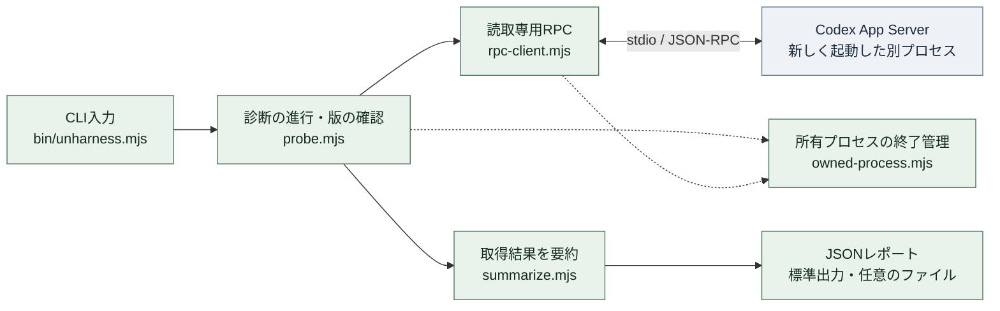
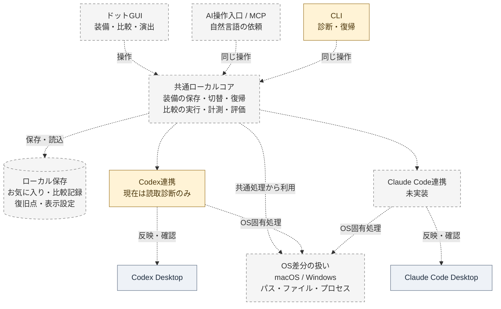

# Architecture boundaries

This page separates the code present on 2026-09-06 from the intended product architecture. The working slice is a read-only Node.js 24+ diagnostic using ES modules and the standard library. The full GUI/MCP/control/storage implementation and their framework/storage choices remain future work.

## Current runnable architecture

The diagram shows the main processing relationships, not every returned value. The probe controller invokes the projection and assembles the report; the CLI owns writing it. Dotted edges are shared-helper dependencies in this first diagram.

| Responsibility | Current code |
| --- | --- |
| Validate command arguments; print JSON; create a report file without overwriting | [bin/unharness.mjs](../bin/unharness.mjs) |
| Read the CLI version, initialize the child app-server, run the fixed queries, assemble evidence flags | [probe.mjs](../src/codex/probe.mjs) |
| Structured process launch, request allowlist, JSON-RPC framing/IDs, response limits and timeouts | [rpc-client.mjs](../src/codex/rpc-client.mjs) |
| Construct summaries from known fields while omitting instruction text, personal paths and arbitrary values | [summarize.mjs](../src/codex/summarize.mjs) |
| Graceful shutdown, forced termination of the owned child when needed, and awaited closure | [owned-process.mjs](../src/codex/owned-process.mjs) |

The four data queries are `config/read`, `skills/list`, `hooks/list`, and `configRequirements/read`, preceded by initialization. No configuration-write request or model task is started by this command.

This process is separate from the desktop app's active session. The report deliberately retains `desktopSessionAttached: false`, `runtimeStateVerified: false`, `modeSwitchingVerified: false`, and `sourceCoverage: "unknown"`. Current persistence is an optional JSON report, not a favorites database or a comparison store. macOS has a real read-only run; Windows evidence is pending.

## Intended product architecture

Every dotted connection below is a planned integration. The CLI and Codex integration boxes have an existing read-only slice; that does not mean they are already connected to the future shared core or can control the desktop. The OS box represents shared responsibilities, not a library already implemented.

The Unharness-owned control and storage layer is intended to run on the user's computer. Existing Codex/Claude Code model execution remains with those applications. No Unharness cloud service is currently part of the base design. Optional AI judging has a contract but no selected execution implementation.

GUI framework, persistent storage technology, and the exact desktop application/reflection mechanism are still undecided. A database symbol above means the storage responsibility; it does not imply SQLite or another database has been selected.

## Shared local core

The web UI and an MCP connection (tools an AI can call) invoke the same operations. The core owns configuration identities, source inventory, versioned favorites, mode policies, change plans, recovery records, experiment conditions, and operation state.

The AI translates a user's request into a registered operation. Filesystem discovery, configuration edits, and restoration are deterministic code. The core must also be callable without the AI so that disabling optional harness elements cannot remove the recovery mechanism.

The core publishes operation events. An open UI reflects them and can animate them; closing the UI or turning effects off cannot change the transaction.

The proposed [appearance workflow](personalization.md) uses prepared art packs and weighted local selection by default. A renderer receives the saved recipe and observed mode/operation state. The user's AI can optionally author pixel data or a component recipe, or use an available image tool, then return assets for validated import. The core owns appearance identities, resolved recipes, art-pack versions, and assets; work-memory profiles and experiment evidence are separate. Default appearance selection does not read personal memory, and optional creation does not run inside candidate benchmark tasks. These paths are not present in the current diagnostic.

## Application integration boundary

Codex and Claude Code each have an adapter responsible for:

- discovering applicable sources and their precedence;
- reporting what can be controlled and what can be verified;
- mapping the shared mode intent to application-specific settings;
- preparing and applying changes within the selected scope;
- arranging or explaining a fresh desktop task and any restart;
- verifying configuration and observable runtime state;
- restoring application-specific changes and reporting conflicts.

Keep app-specific flags, file formats, startup behavior, and runtime evidence out of shared favorite and comparison logic. Do not simulate Claude Code support with a renamed Codex adapter or by assuming CLI behavior matches the desktop app.

An adapter capability report must distinguish controllable, observable, unsupported, and unknown. An unsupported required part of Zero prevents claiming that Zero has been applied.

## OS boundary

macOS and Windows differ in path handling, home and application-data discovery, environment inheritance, process launch, filesystem locking, permissions, links, and replacement semantics. Keep these operations behind a small tested boundary.

Do not construct Windows commands by translating a shell string intended for macOS. Use structured arguments and platform-aware filesystem/process APIs where possible. Preserve original content and encoding where restoration depends on exact bytes; account for line endings and Unicode paths.

Test spaces and non-ASCII names in paths. Record whether the application executes natively on Windows or inside WSL; these have different filesystems and runtime configurations.

## State and persistence

Keep these responsibilities distinct:

- **Favorite:** a named, versioned selection of managed items and their states.
- **Recovery snapshot:** the state required to reverse a specific change without overwriting unrelated edits.
- **Experiment record:** a reference to the exact loadout version, starting conditions, outputs, and observations.
- **Display preferences:** effects and appearance; these do not participate in loadout meaning.
- **Appearance identity and assets:** a seed, resolved recipe, renderer/art-pack versions, and retained artwork. Keep the same entity across modes and restarts; changing its appearance does not change the configuration.
- **Work-memory profile:** task/evaluation preferences with provenance and evidence references. These can inform experiment preparation, but are not used for default appearance selection or automatically injected into trials.

A stale plan cannot silently overwrite newer settings. Changes need an operation identity and concurrency control. A process crash must leave enough information to diagnose and recover a partially applied operation.

The application-specific payload remains identifiable even when a favorite is moved to another OS or app. Missing items, path relocation, content changes, and different capability sets require an explicit compatibility result.

## Common review questions

Can a second entry point duplicate a pending operation? Can an update to a source change a saved favorite? Can a pending next-task setting be mistaken for an active task? Can recovery overwrite someone else's edit? Can a stopped skill take away the only recovery path? These are shared contract questions and must remain covered when adding either application.
