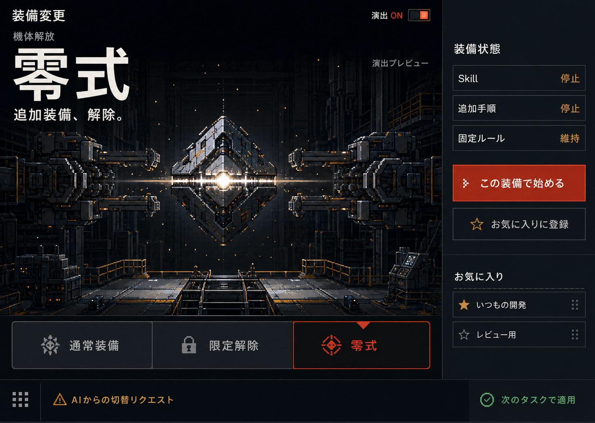
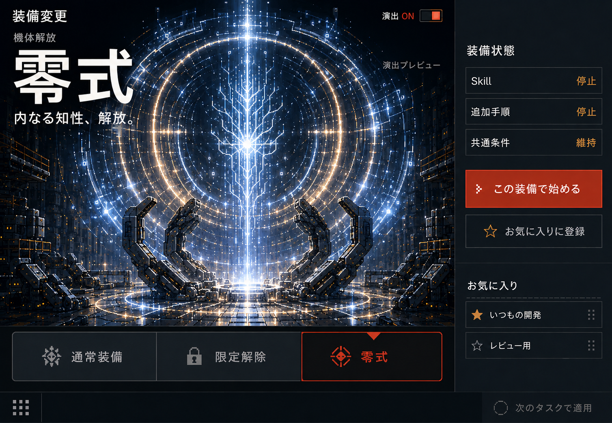
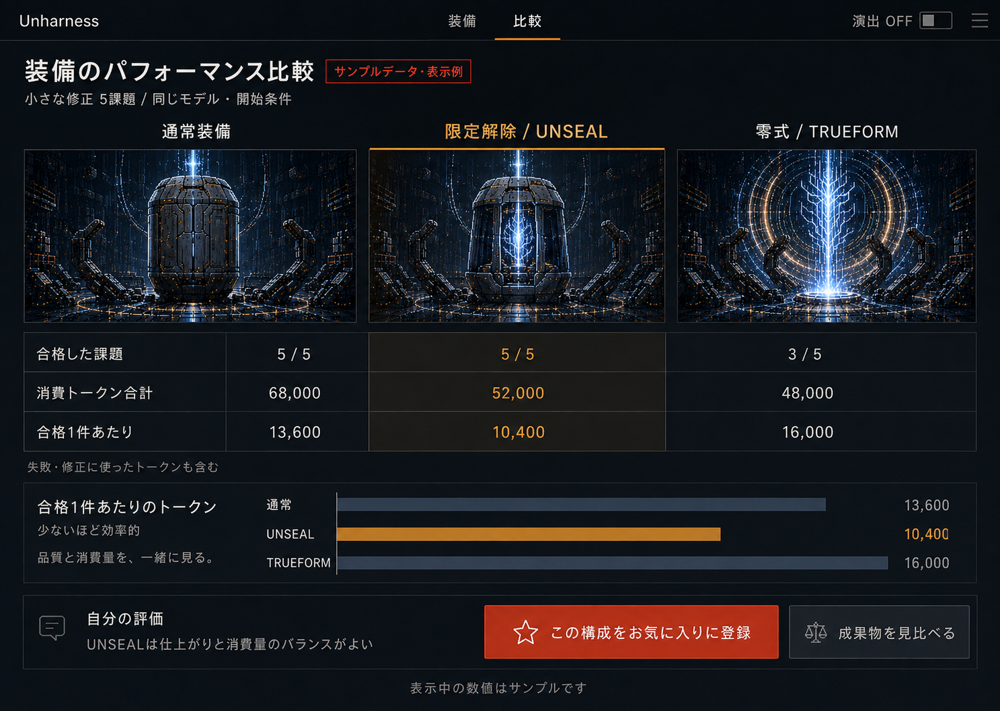

# Visual direction

## Selected concept

The maintainer selected the second exploration image: a pixel-art industrial machine hangar with dark equipment, amber mechanism lights, readable white typography, and vermilion controls.

## Progressive release

The same AI exists inside the outer harness at every stage. Normal keeps the thick casing closed. UNSEAL opens the equipment and partially reveals the entity. TRUEFORM shows the AI rising out of the recognizable empty shell.

The AI entity is provisionally a non-human white-blue luminous lattice. Its exact shape can continue to evolve without changing the agreed inside-to-outside progression.

## Divine climax

The maintainer requested more spectacle and a divine feeling. The refined keyframe keeps the same entity and surrounds it with large luminous rings, a vertical beam, and geometric particles.

These are static design concepts, not screenshots of implemented behavior.

The original generation inputs for these selected assets are preserved in [design-prompts.md](design-prompts.md).

Suggested animation sequence: casing opens → a brief visual pause → rings and particles expand → the AI rises → the scene settles to an idle state. Timing, sound, and motion amplitude are not yet specified. Preserve readable controls and an unambiguous status area throughout.

## Selected rendering stack

On 2026-09-07 the maintainer selected **PixiJS** for the first GUI and explicitly accepted the additional dependencies. The [local fixture GUI](gui.md) now draws 49 coherent poses from the same original armor, supports and branching entity. Each armor piece folds about its seam as a rigid prism; the architecture stays fixed. The [bundled artwork](gui-artwork.md) preserves original foreground material and uses an empty background plate where the apparatus previously hid the wall. Comparison views and the full appearance/collection system remain future work.

| Responsibility | Selected approach |
| --- | --- |
| Entity, armor, layered movement, halos and particles | PixiJS in the browser |
| Controls, readable state, numbers and comparison tables | Semantic HTML and CSS, with charts generated from application data |
| Detailed artwork and animation frames | Reviewed, bundled PNG sprites and sprite sheets |
| Assembly, palette roles, attachment points and animation parameters | Versioned JSON recipes referring to compatible parts |
| Code-authored pixel art and geometric variation | Validated pixel data or local drawing rules producing PixiJS textures/graphics |

This hybrid asset route keeps detailed artwork editable in a pixel editor while allowing an AI without image generation to change recipes or author pixel data. Aseprite is an optional authoring tool; using the app does not require it. Imported appearances remain validated data/images, not executable scripts. See [the appearance contract](personalization.md#pixel-art-does-not-require-an-image-model).

Keep a consistent pixel grid, nearest-neighbor texture sampling and aligned sprite positions. Scope glow and other filters to the intended effect layers so body details and controls remain legible. Effects off and reduced motion need a static, readable presentation. Pause unnecessary animation when the view is hidden and release renderer resources when it is removed. If graphics initialization fails, retain the HTML controls and truthful state display.

Bundle the renderer and default assets for local use; normal playback and candidate assembly must not depend on a CDN or model service. PixiJS belongs to the browser presentation layer, while configuration, recovery and assessment remain in the shared core. The first GUI uses React/TypeScript and Vite. Pinned dependencies are in [package.json](../package.json); setup is documented in [CONTRIBUTING.md](../CONTRIBUTING.md).

Technical references: [PixiJS introduction](https://pixijs.com/8.x/guides/getting-started/intro) and [adding PixiJS to an existing project](https://pixijs.com/8.x/guides/getting-started/quick-start).

## Continuous motion and directional transitions

The maintainer clarified that the scene should feel alive continuously, and that changing modes should animate from the previous displayed form. Whole-painting warps and portrait dissolves were rejected because they made metal and background structures deform. Idle motion now moves only the foreground body, source-sampled light and small particles. Preserve the original fine lattice and mechanical detail; large geometric rings are not part of the selected reference.

Use one visual release path: latch separation → upper/lower plates open in order → supports retreat → armor settles below the rising core. The 49-cel table contains Normal at 0, Manual only at 24 and Fixed only at 48. It is drawn deterministically from reused pieces, rather than generating unrelated images for each step. Armor edge lengths and thickness remain constant in 3D; projected faces retain the same source texture. Cutouts and glow are baked locally once, while the small pose table drives playback. See [the cel sheet](assets/07-mechanical-cels-v4.png) and [the recorded motion](assets/08-mechanical-motion-v4.webm).

Reverse and direct travel use this same ordered table. Retargeting continues from the current release position, and reselecting the same target does not restart it. Timing is about 1.7 seconds per adjacent stage, up to 3.4 seconds for a direct full release/return. The original paintings are the identity and material reference; their independently illustrated end poses are not treated as a physically interchangeable sequence.

The renderer uses active visual time, paused when hidden, and caps its ticker at 30 fps. Effects off and reduced motion settle immediately on the selected canonical cel. Initial loading starts at the selected condition without pretending a new configuration switch occurred. Selection drives a labelled preview; a confirmed checkpoint restore returns that preview to the restored condition. An animation callback never changes preparation, application or verification state.

After accepting the mechanical motion, the maintainer requested a more radiant AI body in the TRUEFORM visual. Two source-shaped white-blue light layers strengthen as the final release completes and pulse slowly at rest. Keep the crisp lattice above the glow so its branches remain readable. This additional radiance is absent in Normal/Manual and disabled by effects off or reduced motion; it does not alter any part pose or configuration state.

On 2026-09-07 the maintainer accepted the combined mechanical motion and final radiance at `a0ce80c` as the visual baseline. Subsequent integration work should preserve this appearance and optional-effects behavior.

## Everyday controls and development details

Keep ordinary use to a mode choice. The accepted [scope refinement](harness-scope.md) centers on self-authored/personally added instructions and automatic Skills, with optional hooks secondary. Memory and native task-continuity remain in the common environment. When real-source registration/control exists, place **設定をAIに相談** near the modes and keep detailed customization in the user's AI conversation; show the resulting saved proposal concisely. Keep paths, IDs and unsupported-source diagnostics secondary. The current read-only inventory uses this hierarchy by showing the three candidate source categories first and collapsing retained information. It does not expose nonfunctional per-item release controls.

The visible lower interface centers on favorites and returning to a recorded pre-change setting, with short explanations of what each operation does. Older recovery points remain available in an expandable history. Task UUIDs, project paths, manual recording checks and CLI recovery coordinates belong in a closed development-details section. Record/plan identifiers remain available when their details are expanded.

This improves readability in the fixture GUI; the eventual product centers on selecting a mode, using it for work, reviewing evidence and keeping a useful setup. Routine users should not have to interpret hashes or manually associate raw task IDs. The verified desktop/AI integration must provide that simpler path. Current diagnostic access remains available until those integrations exist.

## Effects and product state

- Support effects off and reduced motion. These are display preferences, separate from favorites.
- Both web clicks and AI requests can drive the same display state.
- Do not let a completed animation mark configuration as verified.
- A prepared next-task state must not look like a successfully changed current task. Use readable neutral pending indicators.
- Retained task conditions and enforced permissions must be distinguishable from optional harness elements.
- A custom favorite can re-equip its selected configuration; it should not continue displaying Zero when extras have been restored.

The generated concepts include detail that needs UI refinement, especially status contrast and the appearance of successful versus pending application. The animations illustrate configuration changes and do not represent measured intelligence or performance.

## Equipment can support the AI

Supportive armor, an amplifying frame and a resonating ring remain possible visual motifs. On 2026-09-09 the maintainer separated appearance from performance: choosing one of these motifs does not require a favorable comparison and does not certify that a configuration performs better.

The release sequence still reveals the entity, while reloading a useful favorite can assemble supportive equipment around it. This gives both taking equipment off and putting it back on a satisfying visual role. UNSEAL and TRUEFORM remain the same configuration modes; visual assessment does not introduce a fourth mode or alter settings.

Measured performance is displayed separately with its comparison conditions and quality/efficiency priorities. Unknown evidence remains unknown in that display; it does not replace the selected artwork. Do not equate lower token use alone with a better loadout or use equipment style as a performance verdict.

Keep the evidence label visible and let users turn the effect off. Judge outputs without mode art when using blind comparison so the artwork does not predetermine the rating.

Original forms remain freely reusable in a local collection, including when a comparison is adverse or unknown. Do not force BAD art or block another compatible image. Preserve prior items and their history. See [the collection rules](personalization.md#collection-ownership-and-current-presentation). Collection choice changes appearance, not the harness or its evaluation.

## Layered original template

The accepted original-artwork structure is AI entity, restraints and background. Use the current 724×724 scene as the first versioned template, with common coordinates, anchors, known moving restraint parts and front/back order. The three logical groups can use more than three PNGs where the mechanism needs separate pieces. Users can replace one group and keep the prepared others.

The authoring Skill supplies guides and separate-part output, then previews Normal, UNSEAL and TRUEFORM before local import. Reuse the accepted mechanism for compatible parts; do not infer a new rig or physically interchangeable frames from arbitrary full-scene images. Free artwork creation does not change the state-evidence rules or the effects-off contract. See [the layered plan](superpowers/plans/2026-09-09-layered-originals.md).

## Comparison inside the same GUI

The maintainer requested that measured performance be visible in this pixel-art interface. The comparison view uses the same hangar identity, with compact portraits of the three loadouts above a readable table and chart. It leads from inspection to saving the chosen configuration as a favorite.

**Every number and the personal note in this image are sample data. No harness performance was measured to produce it.** The display compares accepted tasks, total tokens including failed/revision work, and tokens per accepted task, following [the measurement contract](comparison-metrics.md). The lower total-token example is not automatically the more efficient successful setup.

The UI should show run count, shared comparison conditions, collection coverage, and whether a value is measured, estimated, or a human/AI assessment. Keep performance inspection separate from the dramatic release effect. Saving a favorite retains the exact tested configuration and its comparison references.

The primary interaction is a single selected mode used for ordinary work. This comparison view reviews saved observations or explicitly requested later replays. The three-column illustration does not imply simultaneous dispatch, and untried modes remain unmeasured. Distinguish matched comparisons from different everyday tasks before displaying a GOOD/BAD interpretation.

The implemented comparison uses actual saved values rather than the chart bitmap: compact crops from the bundled three-state art, aligned semantic table columns and directly labelled horizontal root-response token bars from a common zero baseline. A real zero stays at zero width; missing values say **不明**, and partial values retain their partial label. Unknown source association gets a separate unknown portrait instead of inferred Normal art. The static table/text remains usable if artwork fails, at narrow widths it scrolls within its own bounded region, and no evidence depends on hover.

The view keeps ordinary records neutral, shows attributed checks/ratings/notes on demand, and opens the bounded answer only by explicit plain-text inspection. Mode identity, portrait art and shorter bars never imply GOOD/BAD. The existing Pixi equipment scene and effects preference are unchanged; comparison portraits are static and do not mount extra renderers. Generation input for the concept is preserved in [design-comparison-prompt.md](design-comparison-prompt.md).

## Discovering an original appearance

The maintainer prefers a random discovery over a taste-optimized appearance. The proposed default selects from prepared entities and compatible variations with weighted probabilities, without using personal memories to infer taste. Keep the selected body recognizable across release states and app restarts; sample another appearance only when creating an entity or explicitly requested. The user can keep/name a discovery and associate it with a build card.

Prepared sprites, code-drawn pixel grids, and optional image-model generation are distinct creation routes. Pixel art does not require an image model. The [appearance and memory proposal](personalization.md) defines these routes, reproducible local selection, optional creation skills, and benchmark separation. Random visual rarity is independent of measured performance. The GUI animates fixed bundled reference art; random assembly, the collection runtime and distribution skill remain unimplemented.

## Freely create an original form

Offer **オリジナルイメージを作成** independently of comparison results or the selected mode. The user's AI and bundled authoring Skill discuss desired parts and reference images, use the layer template and show composed previews. **作品を読み込む** stores the chosen local assets; **コレクション** reuses previous work. See [creation and revisions](personalization.md#creation-and-revisions).

Keep the current artwork during creation, cancellation or failure. The user can revise or choose another version without a fixed candidate count or final-choice lock. Preserve prior artwork and any historical evidence, while displaying current performance separately. Effects and image-generation tools remain optional.

After local save/reuse works, continue the [build-card and sharing plan](build-cards.md). A card may show only the selected appearance and small author/site attribution, or include a separately justified comparison summary. Preserve local image-save and manual X handoff; sharing a reusable layer pack or building a public gallery is later design work.
